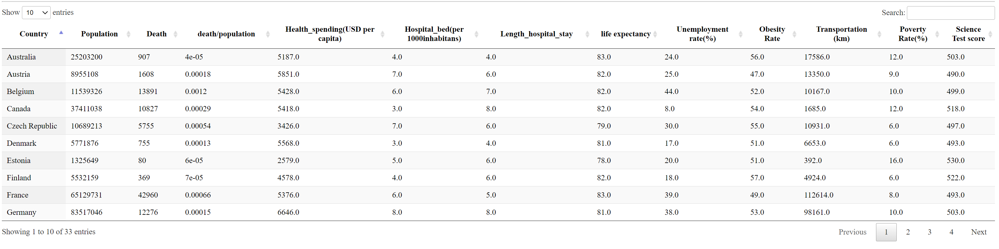

# final-project (Covid-successful Country)

## Purpose

- Create Machine-Learning-Model from statistics data of OECD countries to predict successful country for future unknow viruses

## Dataset for prediction (explanation variables)

    OECD Dataset
    - https://data.oecd.org/pisa/science-performance-pisa.htm
    - https://data.oecd.org/healthres/health-spending.htm
    - https://data.oecd.org/healtheqt/hospital-beds.htm
    - https://data.oecd.org/healthcare/length-of-hospital-stay.htm
    - https://data.oecd.org/healthstat/life-expectancy-at-birth.htm
    - https://data.oecd.org/healthrisk/overweight-or-obese-population.htm
    - https://data.oecd.org/unemp/long-term-unemployment-rate.htm
    - https://data.oecd.org/inequality/poverty-rate.htm

## Dataset for covid (an objective variable)
    COVID API
    - https://rapidapi.com/Gramzivi/api/covid-19-data

## ETL (pandas.ipynb)
- Using Pandas to read csv and transform them to upload Postgres on Heroku
- For futre machine learning, created dataset for training
- Using requests to get Covid data and load into pandas and then to Postgres

## Machine Learning (Neural Network) (machinelearning.ipynb)
Model: 

Result: 

Saved as h5 file.

## Website app.py  (Heroku)
URL: https://bootcamp-coivd.herokuapp.com/

Data table: 

Input form to predict: 

Result: 